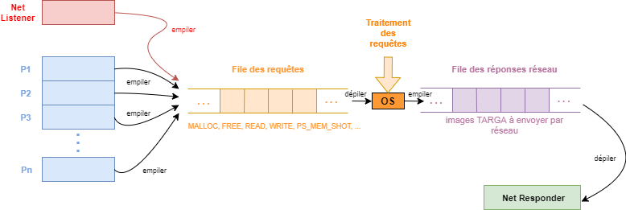

# Virtual Memory Simulator

## Description

as part of a school project, I developed a system that provides a general purpose allocator on top
of a page allocation and virtualization layer. the OS(implemented as a thread) takes alloc/free requests from processes(implemented also as threads).
The system also serves network queries by returning a TARGA image representing the memory state of the system or of a process.
It also uses steganography to conceal information about the client requests in the returned images.

the report (in french) that describes the work done in details, can be found [here](rapport.pdf)

## Implementation details
### General purpose allocator
The general purpose allocator gets/frees pages from the OS and manages their memory using two linked lists representing the free and used memory blocks.
Allocation and deallocation boils down to insert and delete operation on the two linked lists.
Two allocation strategies are supported : worst-fit and best-fit.
### System Architecture

The system implements two communication queues: 
* The request queue: used by the processes threads and the NetListener thread
to push requests that the OS thread pop and process. This is a Multiple Producers Single Consumer problem, and it's implemented using a Semaphore that signals
the availability of requests to process in the queue and a Mutex that controls access to the queue for the producers.
* The network response queue: in order to free(from blocking) the OS thread, network responses are offloaded to the NetResponse thread by pushing them onto
the response queue.

### TARGA images creation

The images sent over the network are created by rendering colored rectangles into a buffer. Text rendering is done using a font atlas.

